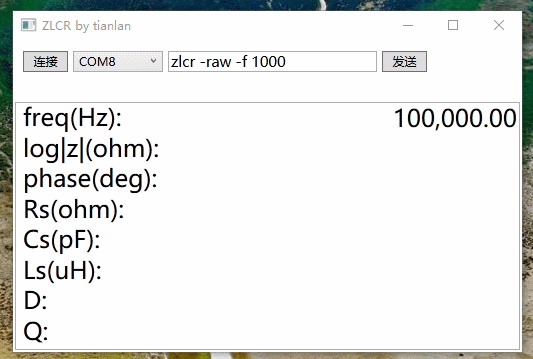
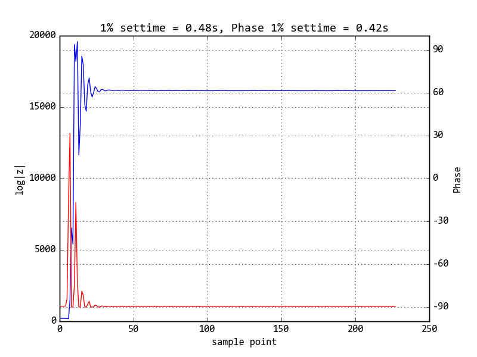

# **ZLCR**
## low cost 100k LCR meter, base on digital Lock-in amplifier

频率范围：1Hz ~ 100kHz  ( 0.01Hz step );  
阻抗范围：10m ~ 10M Ohm ( 1k ref only );  
丢掉PSD和PGA，忘掉DFT、FFT和LMS算法吧，只需2个运放 + ADC/DAC，100k lcr meter带回家。核心算法类似soft define radio 中的数字下变频（数字IQ解调），更准确的定义是 DLIA（Digital Lock-in amplifier，数字锁定放大器）；其实就是将原来模拟器件完成的信号处理整个搬到了数字域，利用浮点运算能力 降低硬件复杂程度。相对于PSD方法，动态范围更高，当信号转换到数字域后，就无需再考虑噪声和失调，动态范围超过100dB；相对于FFT、LMS算法，16bit 4096point 已经算比较高了，而DLIA可以用浮点的 乘法器/CIC/FIR/IIR，DFT：Vi/Vq = 4095/0，DLIA： Vi/Vq = 4.0952341E3 / 1.234354E-2；此外 n=4096 fs=100khz 的FFT 分辨率≈24hz，而DLIA 不存在限制 举个栗子：80,000.00 Hz ~ 80,001.00 Hz扫频，分辨率0.01Hz；  

自己绕的变压器：



阻抗谱：  


10nF 1kHz 1%建立时间：  

  

[更多图片](https://github.com/yitiandelan/ZLCR/tree/master/docs/images)

## 硬件相关：

标准（100k）：  
4 x OPA + 2 x ADC + 1 x DAC + MCU (> 80 DMIPS);  
最低（20k）：  
2 x OPA + USB Audio Codec (such as PCM2904);  
开发版（100k）：  
主控制器：STM32F411CE ( > 80 DMIPS), CNY 24  
ADC/DAC：TLV320AIC3204 (TI audio codec), CNY 10  
AFE：AD8065, 4 x CNY 4  
DEBUGGER：CMSIS-DAP for STM32F072 with CDC / J-Link OB-STM32F072-CortexM, CNY 20  
接口：USB VCP (via DEBUGGER) or 蓝牙串口 (Simple Shell, Data format: JSON)  
Hardware：[100k ZLCR.rev.c.pdf](https://github.com/yitiandelan/ZLCR/blob/master/Hardware/100k%20ZLCR.rev.c.PDF)  
Software：[Firmware for stm32f4xx](https://github.com/yitiandelan/ZLCR/tree/master/Firmware)

## 软件相关：

[Python](https://github.com/yitiandelan/ZLCR/tree/master/pyLCR) / [C#](https://github.com/yitiandelan/ZLCR/tree/master/ZLCR) / Matlab / Windows UWP

### 通信格式：

```JSON
uart tx:
  zlcr -raw -f 1000\n
uart rx:
  {"FREQ":1.000000e+03,"a":-2.304493e+03,"b":-5.388904e+03,"c":-2.319749e+03,"d":-5.420242e+03}\n
  {"FREQ":1.000000e+03,"a":-2.304510e+03,"b":-5.388904e+03,"c":-2.319749e+03,"d":-5.419875e+03}\n
  {"FREQ":1.000000e+03,"a":-2.304507e+03,"b":-5.388909e+03,"c":-2.319749e+03,"d":-5.421182e+03}\n
  {"FREQ":1.000000e+03,"a":-2.304502e+03,"b":-5.388918e+03,"c":-2.319749e+03,"d":-5.423528e+03}\n
uart tx:
  zlcr -f 1000\n
uart rx:
  {"FREQ":1.000000e+03,"MAG":9.937274e-01,"PHASE":-1.291339e-04}\n
  {"FREQ":1.000000e+03,"MAG":9.940118e-01,"PHASE":-2.515127e-04}\n
  {"FREQ":1.000000e+03,"MAG":9.941343e-01,"PHASE":-3.042429e-04}\n
  {"FREQ":1.000000e+03,"MAG":9.939352e-01,"PHASE":-2.185376e-04}\n
```

## 扩展（up to 20M）：

运放构成的auto-balancing bridge并不适合100k以上的测试频率，所以设计了数字桥路平衡控制系统，产生两个激励信号(2 x AD9834)，通过检测不平衡电压/电流(HPF + 40dB AMP + DLIA)，由控制算法调整激励信号幅度和相位，使桥路趋近平衡；同时利用ADC + DLIA 检测V(DUT) & I(DUT)，计算复阻抗，测量结果在桥路达到平衡后误差最小；ADC采样率和计算量增大的问题，解决方案是欠采样（中频采样）。大学时候做过STM32F4欠采样第20奈奎斯特区 观察到明显的孔径抖动 SNR会降低，再往上bandwidth就不够了。对于V(DUT) I(DUT)这种窄带信号，欠采样 + PSD/DLIA 是性能和成本的平衡；对于ΣΔADC，设计了简单的采样保持器 ( 4 x TS5A3159A 未验证)；此外AD9834不能控制幅度，设计通过PWM（AF OD mode）调整 I(FSADJSET) 进行幅度控制，相位利用抖动实现16bit；  
最后，发个还未验证的版本 [20M ZLCR.rev.a.pdf](https://github.com/yitiandelan/ZLCR/blob/master/Hardware/20M%20ZLCR.rev.a.PDF)  

## ref:

[Keysight Technologies Impedance Measurement Handbook](http://literature.cdn.keysight.com/litweb/pdf/5950-3000.pdf)  
[抛砖引玉 基于DSP的LCR表试制 供大家参考](http://www.amobbs.com/thread-5590156-1-1.html)  
[MT-002: 奈奎斯特准则对数据采样系统设计有何意义](http://www.analog.com/media/cn/training-seminars/tutorials/MT-002_cn.pdf)  
[MS-2698：使用同步检测进行精密低电平测量](http://www.analog.com/media/cn/technical-documentation/technical-articles/Use-Synchronous-Detection-to-Make-Precision-Low-Level-Measurements-MS-2698_cn.pdf)  
[基于DLIA的交流阻抗谱测量系统关键技术研究](http://cdmd.cnki.com.cn/Article/CDMD-10487-1012361681.htm)